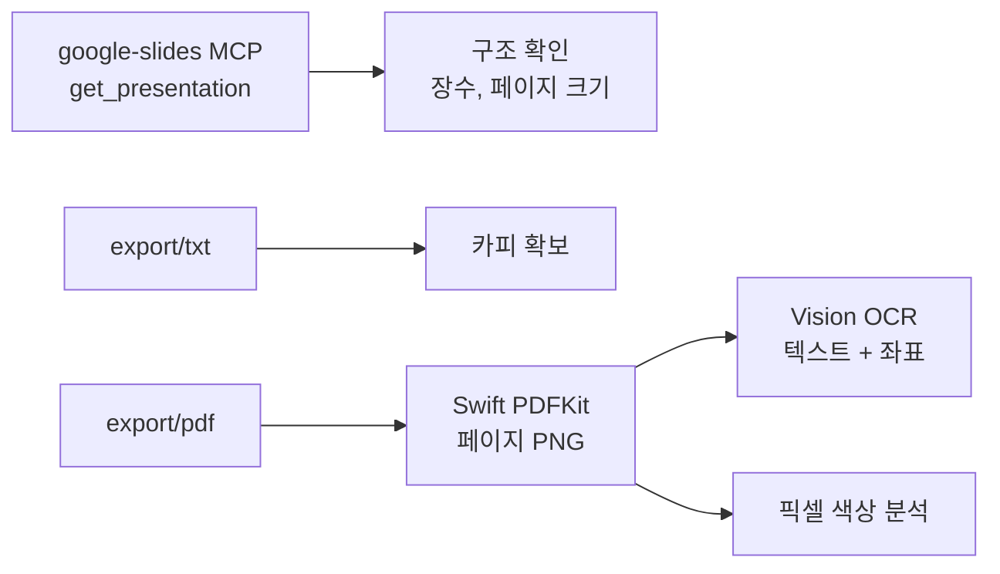

# deck-to-site

## 원본

| 항목 | 값 |
| --- | --- |
| 문서 | 홈페이지 구성안 |
| presentationId | `1QwxNMaX8S20wWK-mf-BXPf5j1uCxwzcQn00jUOh5kyQ` |
| 슬라이드 수 | 9 |
| 페이지 크기 | 720 x 405 pt |

현재 대응 관계는
[`docs/design/DECK_TO_SITE_MAP.md`](../../docs/design/DECK_TO_SITE_MAP.md) 에 있습니다.

## 추출 순서



### 1. 구조

MCP 의 `get_presentation` 은 문서 제목, 장수, 페이지 크기, 슬라이드 ID 를 반환합니다.
요소는 반환하지 않으므로 카피는 다른 경로로 얻습니다.

MCP 도구는 세션 시작 시 로드됩니다. 새로 등록했다면 세션을 재개한 뒤 사용합니다.
도구가 보이지 않으면 짧은 stdio 클라이언트로 직접 호출할 수 있습니다.

### 2. 카피

```
https://docs.google.com/presentation/d/<ID>/export/txt
```

공개 공유 상태면 위 주소로 본문 텍스트를 얻습니다. 리다이렉트를 따라가야 하므로
`curl -sL` 을 씁니다.

### 3. 시각 정보

슬라이드가 이미지 목업을 포함하면 픽셀 정보가 필요합니다.

```bash
curl -sL "https://docs.google.com/presentation/d/<ID>/export/pdf" -o deck.pdf
swift scripts/audit/render.swift ...   # 페이지 PNG 렌더
```

렌더 도구는 macOS 전용입니다. PyObjC 가 없으면 Swift PDFKit 을 사용합니다.

### 4. 목업 내부 텍스트

PNG 에 macOS Vision OCR 을 적용하면 텍스트와 정규화 좌표를 얻습니다. 좌표를 알면
레이아웃 순서를 복원할 수 있습니다.

### 5. 배경 판정

슬라이드 프레임(회색 단색)을 제외한 내부 픽셀의 명도를 세어 라이트/다크를 판정합니다.
프레임 색은 슬라이드마다 동일하므로 먼저 제외해야 합니다.

## 사이트 반영

1. 카피를 `docs/design/DECK_TO_SITE_MAP.md` 의 해당 슬라이드 절에 옮깁니다.
2. 반복되는 문구는 `src/data/` 로 승격합니다.
3. 페이지 명세 [`docs/spec/PAGE_SPEC.md`](../../docs/spec/PAGE_SPEC.md) 를 갱신합니다.
4. `.agents/skills/page-authoring/SKILL.md` 절차로 페이지를 만들거나 고칩니다.
5. `npm run verify` 로 검증합니다.

## 한계와 주의

- 이미지를 육안으로 볼 수 없는 환경에서는 레이아웃 세부를 복원할 수 없습니다. 픽셀
  통계로 판정한 테마와 배치는 담당자 확인이 필요하며, 확인 전까지
  [`docs/context/CURRENT_STATE.md`](../../docs/context/CURRENT_STATE.md) 의 열린 항목에
  기록합니다.
- 사진, 일러스트, 제품 스크린샷은 자동으로 옮기지 않습니다. 필요한 에셋은 원본에서
  추출해 `public/` 에 두고 참조합니다.
- 슬라이드 장수와 페이지 수는 같지 않습니다. 두 슬라이드를 한 페이지로 합치는 판단은
  [`docs/spec/PAGE_SPEC.md`](../../docs/spec/PAGE_SPEC.md) 에 근거와 함께 남깁니다.
