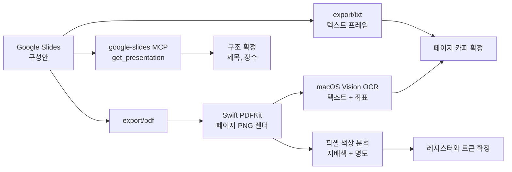

# 슬라이드에서 사이트로 — 원본 대조표

> **작성일**: 2026-09-23
> **버전**: v1.0.0
> **원본**: Google Slides `홈페이지 구성안`
> **목적**: 페이지의 카피와 구조가 어디에서 왔는지 추적 가능하게 유지합니다.
> 카피를 고칠 때 이 문서로 원본과 대조합니다.

---

## 1. 원본 정보

| 항목 | 값 |
| --- | --- |
| 문서 | 홈페이지 구성안 |
| presentationId | `1QwxNMaX8S20wWK-mf-BXPf5j1uCxwzcQn00jUOh5kyQ` |
| 슬라이드 수 | 9 |
| 페이지 크기 | 720 x 405 pt (16:9) |
| 로케일 | ko |

---

## 2. 추출 파이프라인

각 단계가 필요했던 이유:

| 단계 | 이유 |
| --- | --- |
| MCP `get_presentation` | 문서 제목, 장수, 페이지 크기, 슬라이드 ID 확인. 다만 이 도구는 요소를 반환하지 않아 카피는 얻지 못함 |
| `export/txt` | 슬라이드 본문 텍스트를 서비스 계정으로 확보 |
| `export/pdf` + PNG 렌더 | 슬라이드가 이미지 목업을 포함하므로 픽셀 정보가 필요했음 |
| Vision OCR | 목업 안의 실제 화면 텍스트와 배치 좌표를 복원 |
| 픽셀 색상 분석 | 배경이 라이트인지 다크인지, 악센트 색이 무엇인지 판정 |

렌더 도구는 macOS 전용입니다. PyObjC 가 없는 환경에서 Swift PDFKit 을 사용했습니다.

---

## 3. 슬라이드 대응표

| # | 원본 제목 | 원본 내용 | 구현 위치 |
| --- | --- | --- | --- |
| 1 | 접속페이지 | 도메인 접속 시 최초 페이지. 회사소개와 BIDBOX로 구분하여 클릭 시 해당 사이트로 이동 | `/` (`index.astro`) |
| 2 | 회사소개1 | 회사소개 접속 시 표시되는 페이지1 | `/company/` 상단 |
| 3 | 회사소개2 | 회사소개 접속 시 표시되는 페이지2 | `/company/` 본문 |
| 4 | BIDBOX1 | 접속페이지에서 BIDBOX 클릭 시 연결되는 페이지 | `/bidbox/` |
| 5 | BIDBOX2 | BIDBOX의 서비스 소개 | `/bidbox/service/` 상단 |
| 6 | BIDBOX3 | BIDBOX의 서비스 소개2 | `/bidbox/service/` 하단 |
| 7 | BIDBOX4 | BIDBOX의 서비스 비용. 해당 포인트 클릭 시 결재창 이동 | `/bidbox/pricing/` |
| 8 | BIDBOX5 | BIDBOX의 데모 신청 | `/bidbox/demo/` |
| 9 | BIDBOX6 | BIDBOX의 서비스 문의 | `/bidbox/contact/` |

2·3번과 5·6번은 각각 한 페이지의 두 구획으로 합쳤습니다. 슬라이드 장수와 페이지 수가
다르므로, 슬라이드를 추가하면 대응표를 갱신하고 페이지 분할 여부를 판단합니다.

---

## 4. 슬라이드별 복원 내용

목업에서 OCR 로 읽어낸 문장입니다. 사이트 카피의 출처입니다.

### 슬라이드 1 — 접속페이지

- 두 갈래 진입: `회사소개` / `BIDBOX`
- 구현: 허브 카드 2장. 좌측 라이트, 우측 다크로 두 레지스터를 즉시 보여줌

### 슬라이드 2 — 회사소개1

- 로고 `Narani`, 태그라인 `사용자와 소프트웨어는 나란히 일한다`
- 목업이 편집기 화면이며 `index.html`, Tailwind CDN, Alpine.js 코드가 보임
- 모바일 햄버거 메뉴가 함께 그려져 있어 모바일 내비가 요구사항임을 확인

이 슬라이드가 기술 스택의 근거입니다. 정적 HTML + Tailwind + Alpine 구조를 저장소
전체의 기준으로 삼았습니다.

### 슬라이드 3 — 회사소개2

- `전문가가 아니어도 소프트웨어와 같은 눈높이에서 일할 수 있게 만드는 회사입니다.`
- `어려운 데이터와 판단의 근거를 사용자 곁에 나란히 두고, 처음 쓰는 사람도 그 자리에서 확인하고 결정하게 합니다.`
- 구현: 회사소개 페이지의 도입부와 3원칙 카드

### 슬라이드 4 — BIDBOX1

- 제목 `용역분야에 전문화된 입찰서비스`
- 부제 `정보 나열이 아니라, AI로 예상 입찰가까지 제시합니다`
- 행동 `프로그램 접속`

### 슬라이드 5 — BIDBOX2

- 제목 `공공조달 입찰 데이터를 읽고, AI로 낙찰금액을 예상합니다`
- 본문 `Bidbox는 빅데이터 분석과 AI 기술을 결합하여 입찰 시장의 불확실성을 최소화합니다...`
- 3개 카드: `데이터 분석`, `낙찰금액 예측`, `예측근거 제시`
- 이 3개 카드는 슬라이드 4번 랜딩과 서비스 페이지에서 반복되므로
  `src/data/site.ts` 의 `capabilities` 로 단일화했습니다.

### 슬라이드 6 — BIDBOX3

- 제목 `단순 정보 제공이 아니라 AI가 예측한 결과를 제공합니다`
- 본문 `HR분야(근로자파견, 경비업, 위생관리용역업, 직업소개업)에 특화된 서비스로 해당 분야의 데이터만을 학습하여 예측합니다.`
- 2개 카드: `경력 없이도 손쉬운 입찰`, `전문가는 더 정확하게`

### 슬라이드 7 — BIDBOX4

- 제목 `기업의 입찰 성공을 지원합니다`
- 부제 `기업이 비용대비 효율을 체감할 수 있는 비용을 제시합니다`
- 단가 `1포인트 1,000원`, `공고·낙찰 탐색 및 AI 예측당 1포인트`
- 유의 `포인트는 조회당 사용됩니다. 만약 동일한 공고를 재조회 시 포인트는 차감됩니다.`
- 요금제 3종

| 포인트 | 정가 | 할인가 |
| --- | ---: | ---: |
| 100 | `100,000원` | 없음 |
| 500 | `500,000원` | `450,000원` (10% 할인) |
| 1000 | `1,000,000원` | `900,000원` (10% 할인) |

금액은 `src/data/pricing.ts` 단일 소스입니다. 슬라이드에 있던 "포인트 클릭 시 결재창
이동" 은 현재 주문 확인 다이얼로그까지 구현되어 있고, 실제 결제는 제품 본체로
위임할 예정입니다.

### 슬라이드 8 — BIDBOX5

- 제목 `데모 신청`
- 본문 `관심 공고 한 건을 알려 주시면, 예상 낙찰가와 인용 근거를 같은 화면에서 보여 드립니다.`
- 푸터 문구 `BIDBOX Intelligence`, `고성능 입찰 분석을 위해 설계되었습니다.`
- 이 슬라이드의 푸터 문구가 사이트 푸터의 정본이며 `Footer.astro` 에 반영되어 있습니다.

### 슬라이드 9 — BIDBOX6

- 제목 `함께 더 나은 결정을 내리세요`
- 본문 `AI 기술로 입찰의 미래를 열어드리는 Bidbox입니다... 언제든지 문의해 주세요.`
- 폼 항목: `성명`, `이메일`, `문의내용`
- 연락처: `이메일: surport@narani.my`, `채팅 상담: 실시간으로 전문가가 상담을 진행합니다.`

이메일 표기는 오타로 의심되어 열린 항목으로 등록했습니다. 확인 전까지 원본 표기를
유지합니다.

---

## 5. 색 추출 결과

슬라이드마다 배경 프레임(`#2c2c2c`)을 제외한 목업 내부의 지배색을 측정했습니다.

| 슬라이드 | 밝은 픽셀 | 어두운 픽셀 | 상위 색 | 판정 |
| --- | ---: | ---: | --- | --- |
| 1 접속페이지 | 67% | 20% | `#ffffff` 13.5%, `#003067` 1.7% | 라이트 |
| 2 회사소개1 | 20% | 45% | 편집기 화면 회색 계열 | 화면 캡처 |
| 3 회사소개2 | 29% | 37% | 검정 계열 | 다크 성향 |
| 4 BIDBOX1 | 17% | 39% | `#b8ddef` 2.8%, 검정 2.5% | 다크 |
| 5 BIDBOX2 | 38% | 58% | `#15181c` 44.0%, `#b8ddef` 12.4% | 다크 |
| 6 BIDBOX3 | 32% | 61% | 검정 52.5%, `#b8ddef` 16.5% | 다크 |
| 7 BIDBOX4 | 44% | 54% | 검정 46.2%, `#b8ddef` 28.9% | 다크 |
| 8 BIDBOX5 | 47% | 26% | `#b8ddef`, `#042b4e`, `#094579` | 다크 |
| 9 BIDBOX6 | 5% | 94% | 검정 89.9% | 다크 |

결과: 회사소개 계열은 라이트, BIDBOX 계열은 다크. 악센트는 `#b8ddef`, 네이비 계열은
`#042b4e` ~ `#094579`. 이 값들이 `global.css` 의 두 레지스터 토큰이 되었습니다.

---

## 6. 한계

- 추출 세션에서 이미지를 육안으로 확인할 수 없었습니다. 텍스트, 좌표, 색 통계로만
  복원했으므로 **레이아웃 세부와 이미지 요소는 원본과 다를 수 있습니다.**
- 이 한계는 [`../context/CURRENT_STATE.md`](../context/CURRENT_STATE.md) 의 열린 항목
  "테마 시각 미확정" 으로 등록되어 있습니다.
- 슬라이드의 사진, 일러스트, 제품 스크린샷은 사이트에 옮기지 않았습니다. 필요한 경우
  원본에서 에셋을 추출해 `public/` 에 추가해야 합니다.
