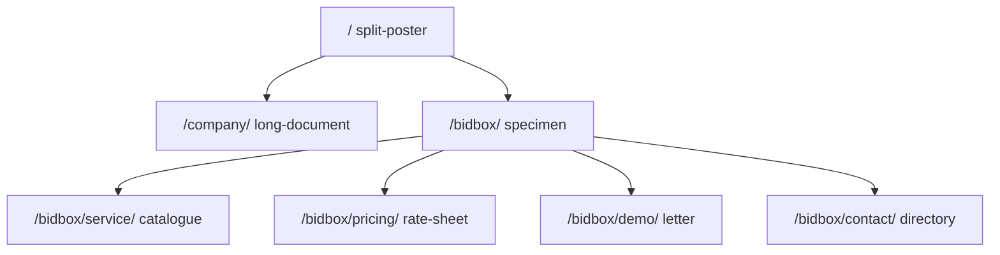

# Hallmark 기준 NARANI 홈페이지 재구성

> **작성일**: 2026-09-23
> **버전**: v1.0.0
> **상태**: 구현 기준
> **출처**: [GeekNews 32321](https://news.hada.io/topic?id=32321), [Nutlope/hallmark](https://github.com/Nutlope/hallmark) v1.1.0 `redesign`
> 이 문서는 카피, 라우트, 정보 구조, 브랜드 색은 유지하고 섹션 리듬만 다시 짜는 구현 기준입니다.
> 색의 실측값은 [`../context/CURRENT_STATE.md`](../context/CURRENT_STATE.md) 만 정본입니다.

---

## 1. 개요

GeekNews에 소개된 Hallmark는 모델이 반복해서 그리는 화면을 거절하는 디자인 절차입니다.
이번 작업은 그 절차의 `redesign` 동사를 적용합니다. 문장, 이동 경로, 컴포넌트 소유, 두 레지스터는
그대로 두고, 일곱 페이지가 같은 "가운데 제목, 세 장의 카드, 끝 배너"로 보이지 않게 구조를 나눕니다.

저장소 제약 때문에 Hallmark 카탈로그 테마 21종, 새 패키지, 새 클라이언트 동작은 넣지 않습니다.
브랜드 앵커(`--nani-*`, `--bb-*`, `--primary`)를 유지하는 tuned 적용입니다.

---

## 2. 배경

현재 사이트는 Astro 7 정적 페이지 7장입니다. 토큰은 `src/styles/global.css` `:root` 한 곳이고,
문구는 `src/data/site.ts`, 금액은 `src/data/pricing.ts` 입니다. Alpine은 모바일 메뉴, 문의 폼,
요금 다이얼로그 세 곳만 씁니다.

눈으로 반복되는 문제는 브랜드가 약해서가 아닙니다. 페이지마다 같은 히어로 그라디언트, 같은
eyebrow, 같은 3열 카드가 붙어 제품 설명이 한 템플릿의 색 바꾸기로 보입니다.

GeekNews 댓글도 제약으로 둡니다. Hallmark 데모처럼 거대한 디스플레이와 장식 서체를 섞으면
그 자체가 또 다른 틀이 됩니다. 이 사이트는 공공조달 회사를 소개하므로 절제를 우선합니다.

---

## 3. 목표와 비목표

### 목표

- 페이지마다 다른 섹션 리듬을 고정합니다.
- 히어로 그라디언트, 가운데 정렬 히어로, 아이콘 타일, 균등 3카드, 영문 대문자 키커를 제거합니다.
- 제목과 본문이 서로 다른 한글 글리프 스택을 쓰게 합니다.
- 페이지 안의 색 리터럴을 `:root` 토큰으로 되돌립니다.
- 기존 검증 계약(메뉴, 폼, 요금 다이얼로그, 320px, 라벨, h1 하나)을 유지합니다.

### 비목표

- 카피 윤문, 요금 변경, 내비 항목 변경, 라우트 추가·삭제
- 이메일 주소 수정 (`surport@` 는 담당자 확인 항목으로 남김)
- 결제, 폼 전송, 서버, 패키지 추가
- Alpine 지점 추가, `x-transition` 추가
- 실측 수치를 이 문서에 단정하는 일

---

## 4. 진단

판정은 2026-09-23 소스 기준입니다.

| 슬롭 | 이 저장소 | 근거 |
| --- | --- | --- |
| 보라색 그라디언트 히어로 | 없음 | 앵커는 네이비 `#003066` 과 블루 `#0073e6` |
| Inter를 디스플레이로 사용 | 없음 | 본문은 Pretendard 계열. 다만 제목과 본문이 같은 스택 |
| 히어로 그라디언트 | 있음 | `src/styles/global.css` 의 `.navy-field`, `.warm-field` |
| 가운데 정렬 히어로 | 있음 | `src/pages/index.astro` 허브 제목·도입·하단 주석 |
| 아이콘 타일 기능 카드 | 있음 | `src/pages/bidbox/service.astro` 가 `capabilities.icon` 을 3열 카드에 그림 |
| 균등 3카드 | 있음 | 회사 01–03, BIDBOX 기능 3열, 요금 3열 |
| 대문자 키커 남용 | 있음 | `.eyebrow` 가 거의 모든 섹션 제목 위에 반복 |
| 범용 알약 내비 | 있음 | `src/components/Header.astro` 한 줄 + 우측 알약 버튼. 회사·제품이 같은 모양 |
| 가짜 터미널 | 있음 | `src/pages/company/index.astro` 의 어두운 `<pre>` |
| 레지스터 혼합 | 있음 | 회사 페이지 하단 `reg-dark` 밴드, 허브의 어두운 카드 |
| 제목 이탤릭 | 없음 | |
| 없는 실적 수치 | 없음 | BIDBOX 첫 화면의 금액은 화면 예시. 회사 실적으로 읽히지 않게 예시라고 밝힘 |
| 토큰 밖 색 | 있음 | 페이지 `style` 의 `#0d1013`, `#B8DDF0`, `#ff8f8f` 등 |

---

## 5. 제안 설계

### 5.1 페이지별 구조

한 시스템 안에서 페이지만 모양을 나눕니다. 직전 페이지와 같은 히어로를 쓰지 않습니다.

| 경로 | 구조 이름 | 히어로 | 본문 | 레지스터 |
| --- | --- | --- | --- | --- |
| `/` | split-poster | 왼쪽 제목, 오른쪽 이동 목록 | 균등 카드 2장 대신 가로 규칙으로 나눈 두 행 | 라이트만 |
| `/company/` | long-document | 좁은 도입문 | 01–03 은 세로 시트. 만드는 것은 본문+옆 메모. 끝 행동은 라이트 | 라이트만 |
| `/bidbox/` | specimen | 왼쪽 문장과 버튼만 | 예시 수치 표, 그 아래 기능 시트 | 다크만 |
| `/bidbox/service/` | catalogue | 왼쪽 문장 | 아이콘 없는 기능 행, 이어서 대조 두 행, 끝 행동은 같은 다크 면 | 다크만 |
| `/bidbox/pricing/` | rate-sheet | 왼쪽 제목, 오른쪽 단가 | 요금은 가로 행. 강조 안은 왼쪽 막대. 다이얼로그 유지 | 다크만 |
| `/bidbox/demo/` | letter | 좁은 설명 열 | 넓은 열이 신청서. 체크 아이콘 없음 | 다크만 |
| `/bidbox/contact/` | directory | 제목 아래 연락처 시트 | 그 아래 좁은 문의 폼. 데모와 다른 세로 적층 | 다크만 |

내비와 푸터는 페이지마다 새로 만들지 않습니다. 컴포넌트는 두 벌의 시각만 가집니다.

| 표면 | 내비 | 푸터 |
| --- | --- | --- |
| 라이트 | 마스트헤드. 위는 로고, 아래 줄은 링크와 행동 | 회사명을 제목 서체로 두고 그 아래 한 줄 |
| 다크 | 한 줄. 링크는 알약이 아니고, 현재 항목은 밑줄. 행동은 세로 선 오른쪽 | 기존의 한 줄 유지 |

모바일 메뉴 DOM 계약은 유지합니다. `header button[aria-controls="mobile-nav"]`, `#mobile-nav` 의
`x-show` 와 `x-cloak`. `x-transition` 은 붙이지 않습니다.

### 5.2 타이포

| 역할 | 토큰 | 스택 |
| --- | --- | --- |
| 제목 (`h1`, `h2`, `.display`) | `--font-display` | Apple Myungjo, Nanum Myeongjo, Batang, 그 다음 Pretendard |
| 본문, `h3`, UI | `--font-body` | 기존 Pretendard Variable 스택 |

한글 글리프가 있는 얼굴을 양쪽에 둡니다. 라틴 전용 디스플레이로 제목을 만들지 않습니다.
제목은 로만만 쓰고 이탤릭을 쓰지 않습니다. 새 폰트 파일과 패키지는 추가하지 않습니다.
명조가 없는 환경에서는 스택 뒤의 Pretendard가 한글을 그리므로 글자가 비지 않습니다.

### 5.3 색과 간격

브랜드 16진 앵커는 바꾸지 않습니다. 히어로 배경은 `--nani-bg` 또는 `--bb-bg` 단색입니다.
`.navy-field` 와 `.warm-field` 의 방사 그라디언트는 제거합니다.

페이지 `style` 에 남은 색은 토큰으로 바꿉니다. 오류색 `--danger`, `--danger-ink`, 악센트 호버
`--bb-accent-hover`, 옅은 면 `--bb-accent-soft` 를 `:root` 에만 추가합니다.

강조색은 버튼, 현재 내비 밑줄, 요금 강조 막대, 금액 숫자에만 씁니다. 면 전체를 채우지 않습니다.

간격은 4의 배수입니다. `.wrap` 좌우 20px 는 24px 로 바꿉니다. 섹션 패딩도 4의 배수 clamp 만 씁니다.

### 5.4 모션

진입용 `.rise` 는 페이지에서 뺍니다. 호버 시 카드를 띄우지 않습니다. 버튼 눌림의 1px 이동과
포커스 링은 상태 표시로 남깁니다. `prefers-reduced-motion: reduce` 규칙은 유지합니다.

### 5.5 컴포넌트 계약

| 계약 | 유지 방법 |
| --- | --- |
| 로고·헤더·푸터 단일 구현 | `Logo.astro`, `Header.astro`, `Footer.astro` 만 수정 |
| 브랜드 문자열 | `src/data/site.ts` |
| 금액, 다이얼로그 제목 | `src/data/pricing.ts`. 두 번째 버튼이 500포인트 |
| 폼 | `enquiryForm`, 기존 id·label·`name` 오류 3개, 성공 제목에 "접수되었습니다" |
| 메뉴 | 열림 `display` 와 `aria-expanded=true`, 닫힘 반대 |
| 검증 | `npm run verify`. 색 기대값이 바뀌면 재측정 뒤에만 정본을 고침 |

허브의 `a.card` 를 걷어 내면 카드 패딩 실측은 더 이상 그 요소를 보지 않습니다. 새 숫자를
미리 적지 않고, 검증 출력으로 [`../context/CURRENT_STATE.md`](../context/CURRENT_STATE.md) 를 고칩니다.

---

## 6. 인터페이스와 데이터

라우트와 `siteNav`, `productNav`, `plans` 스키마는 바꾸지 않습니다.
`capabilities.icon` 은 화면에서 제거합니다. 데이터 필드는 남겨 두되 선색은 `currentColor` 로 바꿉니다.

폼 필드 순서도 유지합니다. 데모의 첫 `input[type=text]` 는 회사명입니다. 검증 스크립트가
그 순서를 봅니다.

---

## 7. 대안

| 안 | 내용 | 판정 |
| --- | --- | --- |
| A. 카탈로그 테마 | Hallmark 21테마 중 하나를 사이트 전체에 덮음 | 기각. 기존 브랜드 앵커와 두 레지스터를 버리고, 데모 미학을 복제함 |
| B. 토큰만 조정 | 그라디언트만 끄고 3카드 구조 유지 | 부분 채택. 그라디언트 제거는 가져가되, 구조가 같으면 재구성이 아님 |
| C. 구조만 교체 | 카피·IA·브랜드 유지, 페이지별 리듬과 서체 역할만 변경 | 채택 |

---

## 8. 보안과 개인정보

이번 변경은 정적 마크업과 CSS 입니다. 새 저장소, 새 전송, 새 쿠키는 없습니다.
폼은 계속 900ms 지연 시뮬레이션이며 엔드포인트가 비어 있습니다.
이메일 주소는 `brand.email` 한 곳에서만 읽습니다.

---

## 9. 운영

서버 지표는 없습니다. 완료 판정은 `npm run verify` 입니다.
실패하면 빌드, 링크, 콘솔, 320px 오버플로우, 라벨 누락 중 어디서 멈췄는지를 보고합니다.
인터랙션 스크립트는 종료 코드로 실패를 올리지 않으므로, 출력의 메뉴·폼·다이얼로그 값을 따로 읽습니다.

되돌리기는 작업 브랜치 `feat/hallmark-redesign` 를 버리거나 해당 커밋을 되돌리면 됩니다.
`main` 에 직접 커밋하지 않습니다.

---

## 10. 위험

| 위험 | 심각도 | 대응 |
| --- | --- | --- |
| 명조가 없는 기기에서 제목이 본문과 같아 보임 | 낮음 | 스택 끝에 Pretendard를 두어 한글이 비지 않음 |
| 회사 페이지에서 다크 밴드를 빼면 제품 인상이 약해짐 | 중간 | 제품 인상은 `/bidbox/` 다크 레지스터가 담당. 회사 페이지는 한 레지스터 |
| 요금 다이얼로그·폼 선택자 파손 | 높음 | 버튼 순서, `h2`, 세 번째 `dd`, 폼 필드 순서를 유지 |
| 320px 가로 넘침 | 중간 | `overflow-x: clip`, 그리드 `minmax(0, …)`, 제목 `overflow-wrap` |
| 정본 수치를 추측으로 고침 | 중간 | 검증 전에 숫자를 쓰지 않음 |

---

## 11. 열린 질문

구현을 막는 질문은 없습니다. 이메일 표기 확인과 결제 연결은 기존 열린 항목이며 이번 범위 밖입니다.

---

## 12. 참고

- https://news.hada.io/topic?id=32321
- https://github.com/Nutlope/hallmark
- https://raw.githubusercontent.com/Nutlope/hallmark/main/skills/hallmark/references/verbs/redesign.md
- [`DESIGN_SYSTEM.md`](DESIGN_SYSTEM.md)
- [`../context/CURRENT_STATE.md`](../context/CURRENT_STATE.md)
- [`../ops/DO_NOT_REPEAT.md`](../ops/DO_NOT_REPEAT.md)

---

## Key Decisions

1. **redesign 동사만 적용한다.** 카피, 라우트, 내비 항목, 브랜드 색, 컴포넌트 소유는 유지하고 섹션 리듬만 바꾼다. 카탈로그 테마를 덮어씌우지 않기 위해서다.
2. **페이지 7장은 서로 다른 구조를 가진다.** 같은 히어로를 반복하면 Hallmark가 거절하는 템플릿이 되기 때문이다.
3. **레지스터는 페이지 단위로만 쓴다.** 회사 소개 안의 다크 밴드와 허브 안의 다크 카드를 제거한다. 제품 표면은 처음부터 다크다.
4. **한글이 있는 두 서체 역할만 둔다.** 새 폰트 패키지 없이 명조 스택과 기존 Pretendard를 나눈다.
5. **토큰 파일은 `global.css` 하나다.** Hallmark의 루트 `tokens.css` 는 만들지 않는다.
6. **모션과 아이콘 타일은 정보가 아니면 뺀다.** 메뉴·폼·다이얼로그 동작은 그대로 둔다.
7. **수치는 재측정 전엔 문서에 쓰지 않는다.**

---

## PR Plan

이 저장소는 Pull Request를 만들지 않습니다. 아래는 `feat/hallmark-redesign` 위의 순서입니다.

### 1. `docs: Hallmark 재구성 기준 문서 추가`

- 영향: `docs/design/HALLMARK_REDESIGN.md`, `docs/design/DESIGN_SYSTEM.md`
- 의존: 없음
- 내용: 진단, 페이지별 구조, 토큰 규칙을 문서로 고정합니다.

### 2. `feat: 히어로 그라디언트 제거와 제목 서체 분리`

- 영향: `src/styles/global.css`
- 의존: 1
- 내용: 단색 히어로, 4배수 간격, 제목/본문 스택, 오류·호버 토큰, 시트 행 클래스.

### 3. `feat: 라이트 마스트헤드와 다크 제품 바 분리`

- 영향: `src/components/Header.astro`, `Footer.astro`, `Logo.astro`
- 의존: 2
- 내용: 모바일 메뉴 계약은 유지하고 데스크톱 시각만 나눕니다. 로고 색은 토큰을 참조합니다.

### 4. `feat: 일곱 페이지 섹션 리듬 재구성`

- 영향: `src/pages/**/*.astro`, `src/data/site.ts`
- 의존: 3
- 내용: 위 표의 구조로 마크업을 바꿉니다. 폼 id, 요금 버튼 순서, 다이얼로그 제목 구조를 유지합니다.

### 5. `docs: 재측정 결과로 상태 정본 갱신`

- 영향: `docs/context/CURRENT_STATE.md`
- 의존: 4, `npm run verify` 출력
- 내용: 검증이 출력한 배경·대비·오버플로우만 반영합니다. 통과 전에 숫자를 채우지 않습니다.
