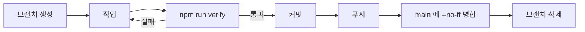

# Git 워크플로우

> **작성일**: 2026-09-23
> **버전**: v1.0.0
> **요약**: 1인 작업. Pull Request 없음. 작업 브랜치에서 커밋 후 `main` 에 `--no-ff` 병합.

---

## 1. 원격

| 항목 | 값 |
| --- | --- |
| 원격 | `https://github.com/kwanbum217/NARANI_HomePage.git` |
| 기본 브랜치 | `main` |

---

## 2. 브랜치 모델

```
main ──●───────────────●───────────────●──
        \             / \             /
         ●───●───●───●   ●───●───●───●
        feat/요금-다이얼로그   fix/모바일-메뉴
```

| 브랜치 | 용도 |
| --- | --- |
| `main` | 배포 가능 상태. 직접 작업하지 않음 |
| `feat/<주제>` | 기능 추가 |
| `fix/<주제>` | 결함 수정 |
| `docs/<주제>` | 문서 변경 |
| `refactor/<주제>` | 동작을 바꾸지 않는 구조 변경 |
| `chore/<주제>` | 설정, 의존성, 도구 |

브랜치 이름의 주제는 한국어로 적어도 됩니다. 공백 대신 하이픈을 씁니다.

`main` 에 직접 커밋하지 않습니다. **최초 부트스트랩 커밋 1건만 예외**이며, 이는 브랜치를
딸 기준점이 없기 때문입니다.

---

## 3. 작업 흐름



명령 예:

```bash
git switch -c feat/요금-결제-딥링크
# 작업
npm run verify
git add -A
git commit -m "feat: 요금 결제 버튼을 제품 본체 라우트로 연결"
git push -u origin feat/요금-결제-딥링크

git switch main
git merge --no-ff feat/요금-결제-딥링크
git push
git branch -d feat/요금-결제-딥링크
```

---

## 4. 커밋 메시지

형식: `type: subject`

| type | 용도 |
| --- | --- |
| `feat` | 기능 추가 |
| `fix` | 결함 수정 |
| `docs` | 문서 |
| `refactor` | 구조 변경 |
| `chore` | 설정, 의존성 |
| `test` | 검증 도구와 시나리오 |
| `ci` | 워크플로우 |
| `merge` | 병합 커밋 |

규칙:

- subject 는 **한국어**로 씁니다.
- 마침표를 붙이지 않습니다.
- 50자 이내를 권장합니다.
- 이모지를 쓰지 않습니다.
- 본문이 필요하면 빈 줄 뒤에 이유를 적습니다. 무엇을 바꿨는지가 아니라 왜 바꿨는지를
  적습니다.

`scripts/validate-commit-message.mjs` 가 커밋 메시지 훅에서 형식을 검사합니다.

---

## 5. 훅

`.pre-commit-config.yaml` 에 다음을 둡니다.

| 훅 | 목적 |
| --- | --- |
| `trailing-whitespace` | 줄 끝 공백 제거 |
| `end-of-file-fixer` | 파일 끝 개행 보장 |
| `check-yaml`, `check-json` | 설정 파일 문법 |
| `check-merge-conflict` | 병합 충돌 마커 차단 |
| `mixed-line-ending` | 개행 혼용 차단 |
| `no-emoji` | 저장소 규칙 위반 차단 |
| `commit-message` | 커밋 메시지 형식 검사(commit-msg 단계) |

설치:

```bash
pipx install pre-commit    # 또는 pip install pre-commit
pre-commit install --install-hooks
pre-commit install --hook-type commit-msg
```

훅이 없더라도 검사를 우회하지 않습니다. `--no-verify` 로 넘기지 않습니다.

---

## 6. 병합 전 확인

- [ ] `npm run verify` 통과
- [ ] 열린 항목 표에 새로 추가할 항목이 없는지 확인
- [ ] 문서에 실측 수치를 복사하지 않았는지 확인
- [ ] 새 의존성을 추가했다면 사전 합의 여부 확인

---

## 7. 금지

1. `main` 에 직접 커밋 (부트스트랩 1건 제외)
2. Pull Request 생성
3. `--no-verify` 로 훅 우회
4. 검증 없이 병합
5. `push --force` 로 공유 이력 재작성
