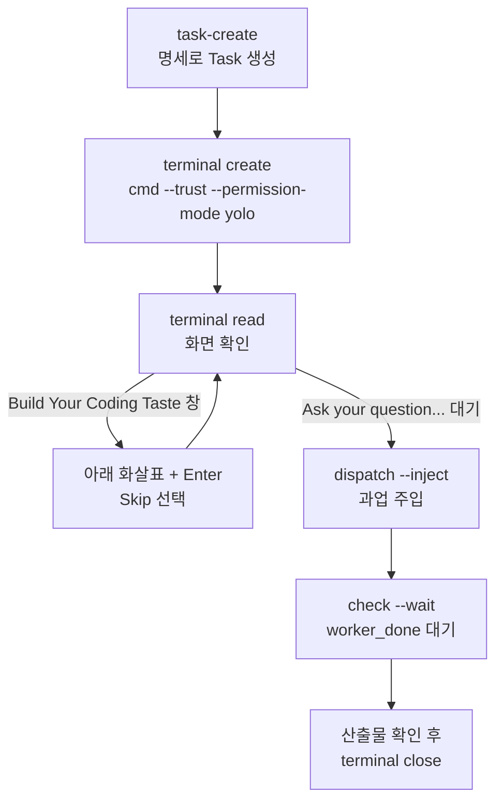

# Orca 워커 운용 명세 (cmd 주력)

> **작성일**: 2026-09-25
> **버전**: v1.0.0
> **상태**: 확정. 2026-09-25 브라우저 비교 세션에서 cmd 워커가 멈춘 원인을 근거로 작성
> **목적**: Claude 코디네이터가 Command Code(cmd) 워커를 멈춤 없이 띄우고 회수하는 절차를
> 고정합니다. 이 문서의 절차에서 벗어나면 워커가 기동 단계에서 멈춥니다.

---

## 1. 역할과 에이전트

| 역할 | 에이전트 | 모델 | 모델 지정 위치 |
| --- | --- | --- | --- |
| 코디네이터 | Claude Code | 세션 모델 | 해당 없음 |
| 주력 워커 | Command Code (`cmd`) | `deepseek/deepseek-v4.1-flash` | `~/.commandcode/config.json` 의 `model` |
| 리뷰어 | opencode | `opencode/muse-spark-1.3-contributor-free` | 기동 명령의 `-m` 인자 |

워커와 리뷰어를 서로 다른 모델 계열로 둡니다. 리뷰는 구현 워커가 `worker_done` 을 보낸 뒤에만
시작합니다.

---

## 2. 사전 조건 (세션 시작 시 1회 확인)

| 항목 | 확인 방법 | 기대값 |
| --- | --- | --- |
| Claude Code 허용 규칙 | `.claude/settings.local.json` | `allow` 에 `Bash(orca terminal *)`, `Bash(orca orchestration *)` |
| cmd 기본 모델 | `~/.commandcode/config.json` 의 `model` | `deepseek/deepseek-v4.1-flash` |
| Orca 기동 | `orca status --json` | `runtime.state` 가 `ready` |

`.claude/settings.local.json` 은 개인 설정이므로 커밋하지 않습니다. 내용은 다음과 같습니다.

```json
{
  "permissions": {
    "allow": [
      "Bash(orca terminal *)",
      "Bash(orca orchestration *)"
    ]
  }
}
```

이 파일이 없으면 코디네이터가 스스로 만들 수 없습니다. 자동 모드 분류기가
"Self-Modification" 으로 거부합니다. 사용자가 직접 만들거나, 기본 권한 모드로 바꾼 뒤
승인해야 합니다.

---

## 3. 기동 절차



| 단계 | 명령 | 비고 |
| --- | --- | --- |
| 1 | `orca orchestration task-create --spec "<명세>" --task-title "<제목>" --run <run_id> --json` | 명세는 5장 형식을 따릅니다 |
| 2 | `orca terminal create --worktree active --title "<제목>" --command "cmd --trust --permission-mode yolo" --json` | `--trust` 는 프로젝트 신뢰 확인을, yolo 는 명령 승인 창을 없앱니다 |
| 3 | `orca terminal read --terminal <handle>` | 입력란 `Ask your question...` 이 보일 때까지 확인합니다 |
| 4 | `orca orchestration dispatch --task <task_id> --to <handle> --run <run_id> --inject --json` | 응답의 `injected` 가 `true` 인지 봅니다 |
| 5 | `orca terminal read --terminal <handle>` | 화면에 `=== TASK ===` 와 첫 도구 호출이 보이면 착수한 것입니다 |

리뷰어는 2단계 명령만 `opencode -m opencode/muse-spark-1.3-contributor-free` 로 바꿉니다.
리뷰어는 코드를 고치지 않으므로 yolo 를 쓰지 않습니다.

---

## 4. 멈춤 원인과 규칙

아래 증상 문자열은 모두 2026-09-25 브라우저 비교 세션(Orca Run `run_2f956b05fdc0`)에서
코디네이터가 직접 받은 응답입니다. Orca 1.4.211, Command Code 1.65.2, Claude Code 자동 모드
기준입니다. 버전이 바뀌면 다시 확인합니다.

### 4.1 코디네이터 쪽 (Claude Code 권한)

| 증상 | 원인 | 규칙 |
| --- | --- | --- |
| `Create Unsafe Agents` 거부 | yolo 에이전트 생성·조작 명령이 허용 규칙에 맞지 않아 분류기로 넘어감 | cmd 워커를 다루는 명령은 **`orca` 단독**으로 실행합니다. 뒤에 `python3`, `jq` 같은 가공 명령을 파이프나 `&&`, `;` 로 붙이지 않습니다. 붙이면 명령 전체가 허용 규칙을 벗어납니다 |
| `Auto-Mode Bypass` 거부 | 거부 직후 비슷한 결과를 다른 경로로 얻으려 함 | 거부되면 즉시 멈추고 사용자에게 보고합니다. 경로를 바꿔 재시도하지 않습니다 |
| `Self-Modification` 거부 | 코디네이터가 권한 파일을 스스로 쓰려 함 | 2장 사전 조건을 사용자가 준비합니다 |

JSON 을 가공해야 하면 `orca ... --json` 결과를 한 번 받은 뒤, 별도 호출에서 읽습니다.
`orca` 명령과 가공 명령을 한 줄에 묶지 않습니다.

### 4.2 Orca 쪽 (command-code 연동)

| 증상 | 원인 | 규칙 |
| --- | --- | --- |
| `worker-start --agent cmd` 가 `agent_unconfigured` | Orca 의 에이전트 id 는 `command-code` | cmd 에 `worker-start` 를 쓰지 않습니다 |
| `worker-start --agent command-code --model ...` 가 `invalid_argument` | command-code 는 기동 시 모델 선택을 지원하지 않음 | 모델은 `~/.commandcode/config.json` 에서 정합니다 |
| `worker-start --agent command-code` 가 `agent_readiness` 시간 초과 | Orca 가 command-code 에 `PreToolUse`, `PostToolUse`, `Stop` 훅만 설치. 기동 시 준비 신호가 없음 | 3장의 `terminal create` + `dispatch --inject` 경로만 씁니다 |
| `terminal wait --for tui-idle` 시간 초과 | 위와 같은 이유 | 기다리지 말고 `terminal read` 로 화면을 봅니다 |
| 같은 Task 3회 실패 후 `failed` | Orca 의 circuit-break | 새 Task 로 우회하려면 사용자 승인을 받습니다 |

### 4.3 cmd 쪽 (기동 화면)

| 증상 | 원인 | 규칙 |
| --- | --- | --- |
| "Build Your Coding Taste" 선택 창 | 같은 프로젝트에 Codex 세션 기록이 있음 | 아래 화살표로 `2. Skip` 을 고른 뒤 Enter 를 보냅니다. `n`(never)은 사용자 설정이므로 누르지 않습니다 |
| 명령마다 승인 창 | yolo 없이 기동 | 구현 워커는 반드시 yolo 로 기동합니다 |

### 4.4 다른 워커 에이전트

| 증상 | 원인 | 규칙 |
| --- | --- | --- |
| codex 가 과업 대신 `brew upgrade --cask codex` 를 실행하고 종료 | 기동 화면의 업데이트 안내가 주입된 Enter 를 받음 | codex 는 주력이 아닙니다. 써야 하면 먼저 수동으로 띄워 업데이트 안내를 넘긴 뒤 주입합니다 |
| opencode 가 다른 모델로 뜸 | 기본 모델이 `~/.config/opencode/opencode.json` 설정을 따름 | 리뷰어는 `-m` 으로 모델을 명시합니다. `worker-start --agent opencode` 는 모델을 지정할 수 없어 쓰지 않습니다 |

---

## 5. 과업 명세 형식

`dispatch --inject` 는 명세를 그대로 워커 화면에 넣습니다. 명세 하나만 읽고 끝낼 수 있게
다음 다섯 가지를 모두 적습니다.

| 항목 | 내용 |
| --- | --- |
| 대상 | 저장소 절대 경로, 브랜치, 대상 파일 또는 페이지 |
| 변경 | 만들어야 할 결과물과 경로 |
| 제약 | `AGENTS.md` 준수, 패키지 설치 금지, 수정 금지 경로, 커밋 금지 여부 |
| 소유 | 워커가 쓸 수 있는 경로. 병렬 워커끼리 겹치지 않게 나눕니다 |
| 수용 기준 | 완료를 증명하는 출력. 두 번 실행해 같은 값인지 등 |

병렬 워커가 `npm run build` 를 돌리면 `dist/` 가 바뀝니다. 측정 워커에게는 `dist/` 의 복사본을
따로 줍니다. 복사본을 만들 때 `git rev-parse HEAD` 결과를 같은 폴더에 텍스트로 남깁니다.

워커가 "두 번 실행해 같았다"고 보고하면 두 실행의 결과 파일이 모두 남아 있는지 확인합니다.
결과 파일 경로가 고정된 스크립트는 2차 실행이 1차 결과를 덮어씁니다. 명세에 실행별 파일 이름을
지정합니다.

---

## 6. 감시와 회수

`dispatch --inject` 경로는 Orca 가 감독하지 않는 레인입니다. `worker-stop` 과
`worker-release` 는 터미널을 닫지 않습니다.

| 시점 | 명령 | 판단 |
| --- | --- | --- |
| 대기 | `orca orchestration check --wait --types "worker_done,escalation,question" --timeout-ms 900000 --json` | 시간 초과는 실패가 아니라 중간 점검입니다 |
| 진행 확인 | `orca terminal read --terminal <handle>` | 도구 호출이 이어지면 진행 중입니다 |
| 완료 수락 | 산출물 파일을 직접 열어 `worker_done` 요약과 대조 | 불일치하면 수락하지 않습니다 |
| 회수 | `orca terminal close --terminal <handle> --json` | 수락한 뒤에만 닫습니다 |
| 메시지 처리 | `orca orchestration check --ack <delivery_id> --json` | 배치의 모든 메시지를 처리한 뒤 ack 합니다 |

끝난 워커 터미널은 닫습니다. 사용자가 탭을 만진 터미널은 Orca 가 `user_takeover` 로 보존하므로
사용자에게 닫아 달라고 요청합니다.
