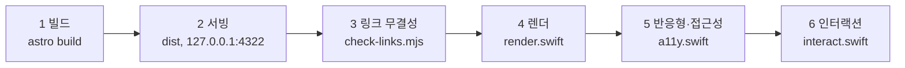

# 검증과 접근성

> **작성일**: 2026-09-23
> **버전**: v1.0.0
> **도구 위치**: `scripts/verify.sh`, `scripts/audit/`, `scripts/check-links.mjs`
> 기준선 수치의 정본은 [`../context/CURRENT_STATE.md`](../context/CURRENT_STATE.md) 입니다.

---

## 1. 실행

```bash
npm run verify
```

`scripts/verify.sh` 는 다음 6단계를 순서대로 수행하고, 실패 시 종료 코드 1 을 반환합니다.



---

## 2. 단계별 의미와 실패 기준

| 단계 | 검사 내용 | 실패 기준 |
| --- | --- | --- |
| 1 빌드 | Astro 정적 빌드 | 빌드 오류 |
| 2 서빙 | `dist/` 를 로컬 HTTP 로 제공 | 서버 기동 실패 |
| 3 링크 무결성 | 모든 `href`/`src` 의 대상 실존 | 깨진 참조 1건 이상 |
| 4 렌더 | 7개 페이지 WebKit 렌더, 콘솔 수집, 스타일 실측, 스크린샷 | 콘솔 오류 1건 이상 |
| 5 반응형·접근성 | 320px 문서 오버플로우, 라벨 누락 | 문서 오버플로우 또는 라벨 누락 1건 이상 |
| 6 인터랙션 | 메뉴 토글, 폼 상태, 다이얼로그 | 기대 상태 불일치 |

4단계와 5단계는 판정 출력의 마지막 줄을 검사합니다.

- `0 page(s) with JS errors`
- `0 issue group(s)`

---

## 3. 검증 도구

| 도구 | 역할 |
| --- | --- |
| `scripts/audit/render.swift` | 경로와 뷰포트를 받아 렌더. 배경색, 텍스트색, 명도 대비, 컴포넌트 치수, 요금 카드 수, 다이얼로그 존재, 푸터 문구, 콘솔 오류를 JSON 으로 출력하고 스크린샷을 저장 |
| `scripts/audit/a11y.swift` | 문서 오버플로우, 라벨 없는 입력, 작은 터치 타겟, `h1` 개수, `lang`, 이미지 `alt` 누락 검사 |
| `scripts/audit/interact.swift` | 페이지에서 임의의 JS 시나리오를 실행하고 `window.__it` 결과를 수집 |
| `scripts/audit/checks/*.js` | 인터랙션 시나리오. `nav.js`, `form.js`, `dialog.js` |
| `scripts/check-links.mjs` | `dist/` 전체 링크 무결성 |

도구는 macOS WebKit 을 사용합니다. PyObjC 없이 Swift PDFKit 과 WKWebView 로 동작하므로
macOS 또는 macOS 러너에서만 실행됩니다.

---

## 4. 접근성 하한

다음은 협상 대상이 아닙니다. 새 컴포넌트를 만들 때 함께 만족시킵니다.

| 항목 | 기준 |
| --- | --- |
| 본문 명도 대비 | 4.5:1 이상 |
| 포커스 표시 | 모든 대화형 요소에 점선 2px, 오프셋 3px. `outline: none` 단독 사용 금지 |
| 라벨 | 입력에 항상 보이는 라벨. placeholder 를 라벨로 쓰지 않음 |
| 터치 타겟 | 최소 44 x 44 px |
| 상태 전달 | 색만으로 전달하지 않음. 아이콘이나 텍스트를 동반 |
| 키보드 | 모든 흐름을 키보드만으로 완료 가능 |
| 줌 | 200% 확대와 320px 리플로우에서 레이아웃 유지 |
| 이미지 | 의미 있는 이미지에 `alt`. 장식이면 `aria-hidden` |
| 랜드마크 | 페이지당 `h1` 1개, `header`/`main`/`footer` 사용 |
| 언어 | `html lang="ko"` |

입력 필드의 글자 크기는 16px 이상을 유지합니다. iOS Safari 는 16px 미만 입력에서
자동 확대를 일으켜 레이아웃을 깨뜨립니다.

---

## 5. 알려진 함정

| 함정 | 대응 |
| --- | --- |
| 알파인 `x-cloak` + `x-show` + `x-transition` 동시 사용 | 전환이 반대로 동작합니다. 전환을 제거하거나 다른 방식으로 처리. [`../ops/DO_NOT_REPEAT.md`](../ops/DO_NOT_REPEAT.md) |
| 스크롤 컨테이너 내부 요소의 오버플로우 | 문서 폭을 밀지 않으므로 감사에서 제외해야 합니다. `a11y.swift` 가 조상의 `overflow-x` 를 확인합니다 |
| Tailwind 4 important 접두사 | `!p-0` 은 무효입니다. `p-0!` 를 씁니다 |
| `grep -r --include` 무음 누락 | 파일 목록을 명시적으로 넘깁니다 |

---

## 6. 검사를 추가하는 방법

새 인터랙션 시나리오는 다음 형식으로 추가합니다.

```js
// scripts/audit/checks/example.js
(async () => {
  const sleep = (ms) => new Promise((r) => setTimeout(r, ms));
  const rep = {};
  // ... 조작과 측정 ...
  window.__it = JSON.stringify(rep);
})();
```

`scripts/verify.sh` 의 6단계에 `"/경로/|1440x900|scripts/audit/checks/example.js"` 를
추가합니다.

새 페이지를 추가하면 `scripts/verify.sh` 의 `PAGES` 와 `NARROW` 배열에도 추가합니다.
목록에 없으면 검증되지 않습니다.

---

## 7. 검증 범위 밖

| 항목 | 이유 | 대체 수단 |
| --- | --- | --- |
| 실제 브라우저 3종(Chrome, Safari, Firefox) | 도구가 WebKit 단일 | 배포 전 육안 확인 |
| 스크린 리더 실제 동작 | 자동화 미구성 | VoiceOver 수동 점검 |
| 이미지 시각 품질 | 추출 세션이 이미지를 볼 수 없었음 | 담당자 육안 확인 |
| 폼 실제 전송 | 엔드포인트 미연결 | 연결 후 별도 검증 |
| 결제 | 미연결 | 제품 본체 연동 후 |
